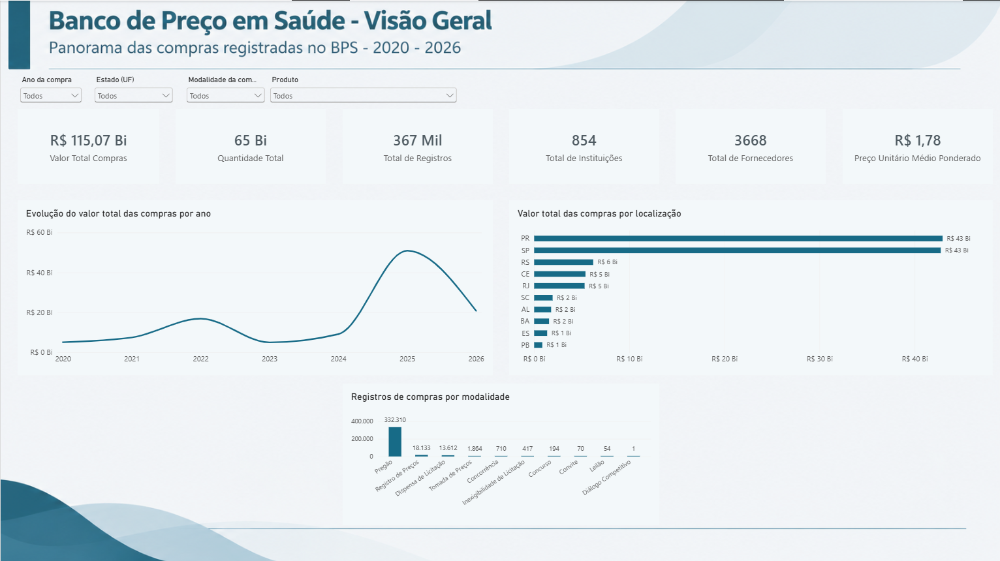
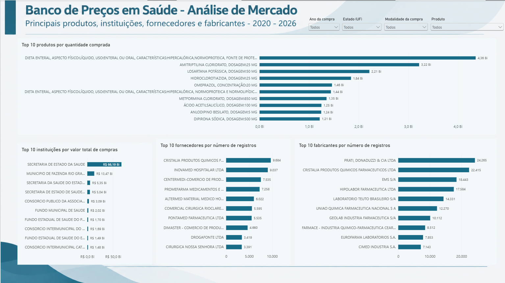
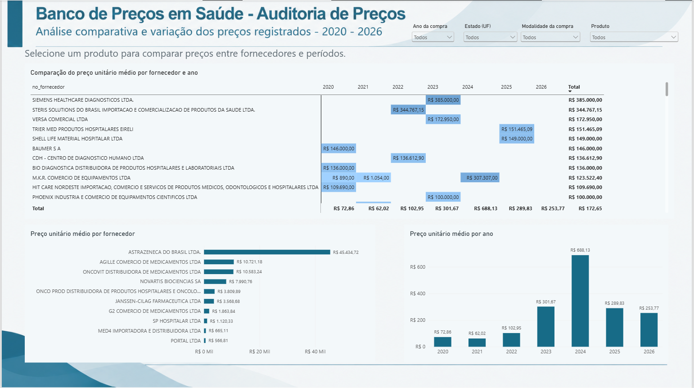

# Mini-Projeto Avaliativo - Módulo 2

**Curso:** Visualização de Dados e Business Intelligence - SCTec  
**Aluna:** Zaira Nanci Zatelli Wendt  
**Turma:** Turma 2  
**Projeto:** Dashboard de Compras de Medicamentos e Dispositivos Médicos - BPS  
**Período analisado:** 2020 a 2026  
**Ferramenta principal:** Power BI  

# Análise das Compras de Medicamentos e Dispositivos Médicos - BPS

## 1. Objetivo do Projeto

Este projeto foi desenvolvido como parte do Mini-Projeto Avaliativo do Módulo 2 do curso de Visualização de Dados e Business Intelligence - SCTec.

O objetivo é desenvolver um dashboard para analisar as compras de medicamentos e dispositivos médicos registradas no Banco de Preços em Saúde (BPS) entre os anos de 2020 e 2026.

A análise busca facilitar a visualização dos dados e permitir a comparação de valores, quantidades, instituições compradoras, fornecedores, produtos, modalidades de compra e preços ao longo do período.

## 2. Contextualização do Problema

O Banco de Preços em Saúde reúne informações sobre compras de medicamentos e dispositivos médicos realizadas por instituições públicas e privadas.

Como a base possui uma grande quantidade de registros e diferentes informações relacionadas às compras, a utilização do Power BI permite organizar os dados e transformá-los em visualizações que facilitam a identificação de padrões, concentrações e variações.

As diferenças de preços encontradas não devem ser interpretadas isoladamente como economia, sobrepreço ou irregularidade, pois podem estar relacionadas a fatores como fabricante, apresentação do produto, unidade de fornecimento, quantidade adquirida, localidade, modalidade e período da compra.

## Perguntas de Negócio

Para orientar a construção do dashboard e as análises, foram consideradas as seguintes perguntas:

1. Como evoluiu o valor total das compras entre 2020 e 2026?
2. Quais estados, municípios e instituições apresentam maior volume financeiro de compras?
3. Quais medicamentos e dispositivos médicos foram mais adquiridos?
4. Quais fornecedores e fabricantes possuem maior participação nos registros?
5. Como os preços unitários variam entre fornecedores e ao longo do período analisado?
6. Quais modalidades de compra apresentam maior quantidade de registros?
7. Existem diferenças relevantes de preços entre produtos comparáveis?

## 3. Fonte dos Dados

Os dados utilizados são provenientes do Banco de Preços em Saúde (BPS), disponibilizado pelo Ministério da Saúde no Portal Brasileiro de Dados Abertos.

Foram utilizados os arquivos em formato CSV referentes aos anos de 2020, 2021, 2022, 2023, 2024, 2025 e 2026.

Também foi utilizado o dicionário de dados oficial do BPS para auxiliar na compreensão das colunas e informações disponíveis.

## 4. Obtenção e Concatenação das Bases

Os arquivos anuais do BPS foram baixados individualmente em formato CSV e armazenados em uma mesma pasta.

No Power BI, foi utilizado o Power Query para importar os arquivos da pasta e combiná-los em uma única consulta. Como os arquivos apresentavam a mesma estrutura de colunas, foi possível concatenar as bases e formar uma única base histórica para o período de 2020 a 2026.

Foi mantida a coluna arquivo_origem, permitindo identificar de qual arquivo anual cada registro foi importado.

A quantidade de registros identificada em cada arquivo foi:

| Ano | Registros |
|---|---:|
| 2020 | 84.919 |
| 2021 | 85.012 |
| 2022 | 89.546 |
| 2023 | 33.809 |
| 2024 | 28.815 |
| 2025 | 34.174 |
| 2026 | 11.090 |

Após a concatenação, a base consolidada apresentou 367.365 registros.

A base consolidada foi gerada no arquivo BPS_20_26_zaira.csv, contendo 367.365 registros. Devido ao tamanho do arquivo, aproximadamente 161 MB, o CSV não foi versionado no GitHub. O processo utilizado para gerar e validar a base consolidada está disponível no arquivo consolidar_bps.ipynb deste repositório.

## 5. Tratamentos e Transformações dos Dados

A preparação dos dados foi realizada no Power Query antes da construção das análises.

Os principais tratamentos realizados foram:

- combinação dos arquivos CSV de 2020 a 2026;
- ajuste dos cabeçalhos das colunas;
- remoção das linhas de cabeçalho que apareceram novamente após a combinação;
- validação da coluna ano_compra;
- verificação dos valores de UF e esfera administrativa;
- ajuste dos tipos de dados;
- conversão das colunas dt_compra e dt_insercao para o tipo Data;
- conversão das colunas vl_capacidade, vl_preco_unitario e vl_preco_total para formato numérico;
- conversão da coluna qt_medicamento para número inteiro;
- verificação da qualidade dos dados utilizando o perfil de dados do Power Query;
- verificação de valores ausentes e possíveis duplicidades;
- seleção das colunas necessárias para as análises.

Os valores nulos não foram excluídos automaticamente, pois a ausência de informação em determinado campo não significa necessariamente que todo o registro da compra seja inválido.

Também foram verificadas possíveis duplicidades utilizando a coluna co_seq_bps como referência. Como não foram identificadas duplicidades na amostra verificada, não foi aplicada a remoção automática desses registros.

Após a combinação, a base possuía 37 colunas, incluindo arquivo_origem. Foram removidas 7 colunas que não seriam utilizadas nas análises:

- validade_compra
- co_grupo
- no_grupo
- co_classe
- no_classe
- nu_processo_compra
- nu_ata

A base utilizada no projeto permaneceu com 30 colunas.

## 6. Principais Colunas Utilizadas

| Coluna | Descrição |
|---|---|
| `ano_compra` | Ano em que a compra foi realizada. |
| `dt_compra` | Data da compra. |
| `co_catmat` | Código CATMAT utilizado para identificação do produto. |
| `ds_item` | Descrição do medicamento ou dispositivo médico. |
| `qt_medicamento` | Quantidade adquirida. |
| `vl_preco_unitario` | Preço unitário registrado. |
| `vl_preco_total` | Valor total registrado para a compra do item. |
| `no_instituicao` | Nome da instituição compradora. |
| `cnpj_instituicao` | CNPJ da instituição compradora. |
| `no_fornecedor` | Nome do fornecedor. |
| `cnpj_fornecedor` | CNPJ do fornecedor. |
| `no_fabricante` | Nome do fabricante. |
| `sg_uf` | Unidade Federativa da instituição compradora. |
| `no_municipio` | Município da instituição compradora. |
| `modalidade` | Modalidade utilizada na compra. |
| `un_fornecimento` | Unidade de fornecimento do produto. |

## 7. KPIs e Métricas

Após a preparação dos dados, foram criadas medidas no Power BI utilizando DAX.

Os principais indicadores utilizados foram:

- **Valor Total das Compras:** soma dos valores totais registrados.
- **Quantidade Total:** soma das quantidades adquiridas.
- **Total de Registros:** quantidade de registros da base consolidada.
- **Total de Instituições:** contagem distinta das instituições pelo CNPJ.
- **Total de Fornecedores:** contagem distinta dos fornecedores pelo CNPJ.
- **Preço Unitário Médio:** média dos preços unitários registrados.
- **Preço Unitário Mediano:** mediana dos preços unitários registrados.
- **Preço Unitário Médio Ponderado:** valor total das compras dividido pela quantidade total adquirida.

O preço unitário não foi somado, pois essa operação não representa uma informação adequada para análise.

A média e a mediana foram utilizadas para auxiliar na avaliação dos preços, já que valores muito altos ou muito baixos podem influenciar a média.

O preço médio ponderado deve ser interpretado com cautela quando diferentes produtos, apresentações ou unidades de fornecimento são analisados em conjunto.

## 8. Dashboard

O dashboard foi desenvolvido no Power BI e organizado em três páginas.

### Visão Geral

Apresenta os principais KPIs e permite acompanhar a evolução das compras por ano, o valor registrado por localização e a quantidade de registros por modalidade.

### Análise de Mercado

Apresenta rankings dos produtos mais adquiridos, instituições com maior valor de compras e fornecedores e fabricantes com maior participação nos registros.

### Auditoria de Preços

Permite analisar o comportamento do preço unitário médio entre fornecedores e ao longo dos anos. O filtro de produto possibilita realizar comparações mais específicas.

As páginas possuem filtros interativos para:

- ano da compra;
- estado (UF);
- modalidade da compra;
- produto.

## 9. Principais Análises e Descobertas

A construção do dashboard permitiu identificar alguns comportamentos importantes na base analisada:

- O valor total registrado das compras apresenta variações entre os anos analisados.
- Os valores das compras não estão distribuídos de maneira uniforme entre estados e municípios.
- Os rankings permitem identificar os produtos com maiores quantidades adquiridas e as instituições com maior valor registrado.
- Alguns fornecedores e fabricantes apresentam maior participação em número de registros.
- As modalidades de compra apresentam diferenças na quantidade de registros.
- Foram observadas variações nos preços unitários entre fornecedores e períodos.

A quantidade de registros de fornecedores e fabricantes representa sua participação na base e não significa necessariamente maior valor financeiro ou maior quantidade fornecida.

Os dados de 2026 devem ser interpretados com cautela, pois podem não representar o ano completo.

## 10. Recomendações

Com base nas análises realizadas, o dashboard pode ser utilizado como ponto de partida para investigações mais detalhadas, como:

- analisar produtos com diferenças relevantes de preço entre fornecedores;
- comparar os preços de um mesmo produto em diferentes períodos;
- verificar diferenças de preços entre instituições e localidades;
- analisar a relação entre modalidade de compra e preço;
- investigar produtos ou períodos que apresentem variações de preço relevantes.

Para comparações de preços, é importante considerar produtos com características semelhantes, principalmente código CATMAT, unidade de fornecimento, apresentação, quantidade adquirida e período da compra.

## 11. Limitações da Análise

Algumas limitações devem ser consideradas na interpretação dos resultados:

- Os dados de 2026 podem não representar o ano completo.
- Alguns campos apresentam valores ausentes.
- O preço unitário pode variar conforme apresentação, unidade de fornecimento, quantidade, fabricante, fornecedor, instituição, localidade, modalidade e período.
- Comparações diretas entre produtos diferentes podem gerar interpretações inadequadas.
- A média dos preços pode ser influenciada por valores muito altos ou muito baixos.
- Os resultados dependem das informações registradas e disponibilizadas na base do BPS.

Por esses motivos, o dashboard deve ser utilizado como ferramenta de apoio à análise e identificação de possíveis pontos de investigação.

## 12. Como Consultar e Reproduzir o Projeto

O dashboard foi desenvolvido no Power BI e está disponível no arquivo projeto_bps_zaira.pbix deste repositório.

Para consultar e reproduzir o projeto:

1. Baixe o arquivo projeto_bps_zaira.pbix.
2. Abra o arquivo utilizando o Power BI Desktop.
3. Navegue pelas três páginas disponíveis no relatório:
   - **Visão Geral**
   - **Análise de Mercado**
   - **Auditoria de Preços**
4. Utilize os filtros de ano da compra, estado (UF), modalidade e produto para explorar os dados.
5. Passe o cursor sobre os gráficos para visualizar informações adicionais disponíveis nas dicas de ferramenta.

Na página **Visão Geral**, podem ser consultados os principais indicadores e o comportamento geral das compras registradas.

Na página **Análise de Mercado**, estão disponíveis os rankings de produtos, instituições, fornecedores e fabricantes.

Na página **Auditoria de Preços**, é possível analisar as variações dos preços registrados entre fornecedores e períodos. Para comparações mais específicas, recomenda-se selecionar um produto no filtro disponível na página.

## Ferramentas Utilizadas

- Power BI
- Power Query
- DAX
- Git
- GitHub

## Conclusão

O projeto permitiu organizar e analisar os dados do Banco de Preços em Saúde referentes ao período de 2020 a 2026 e transformar uma base extensa de registros em informações mais fáceis de visualizar.

Com o dashboard foi possível acompanhar a evolução das compras, identificar produtos e participantes com maior presença na base e explorar variações nos preços registrados.

O resultado é uma ferramenta de apoio à análise que permite explorar os dados de forma interativa e identificar pontos que podem ser investigados com maior detalhe.